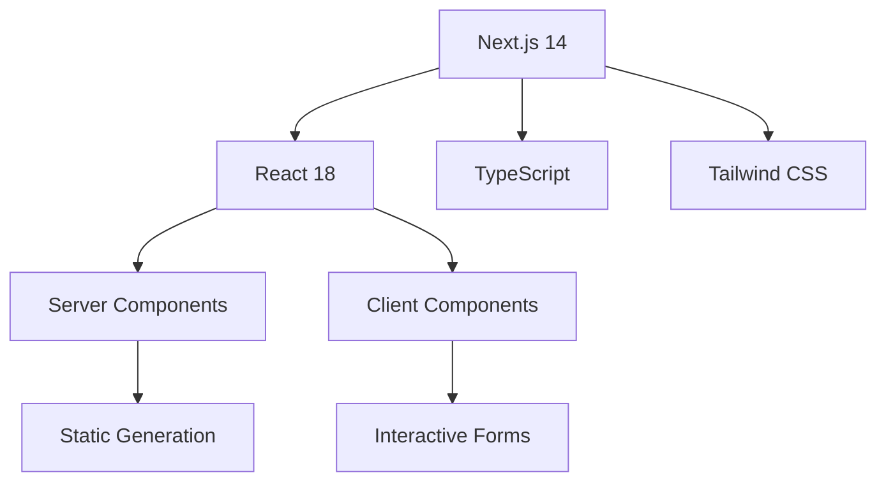
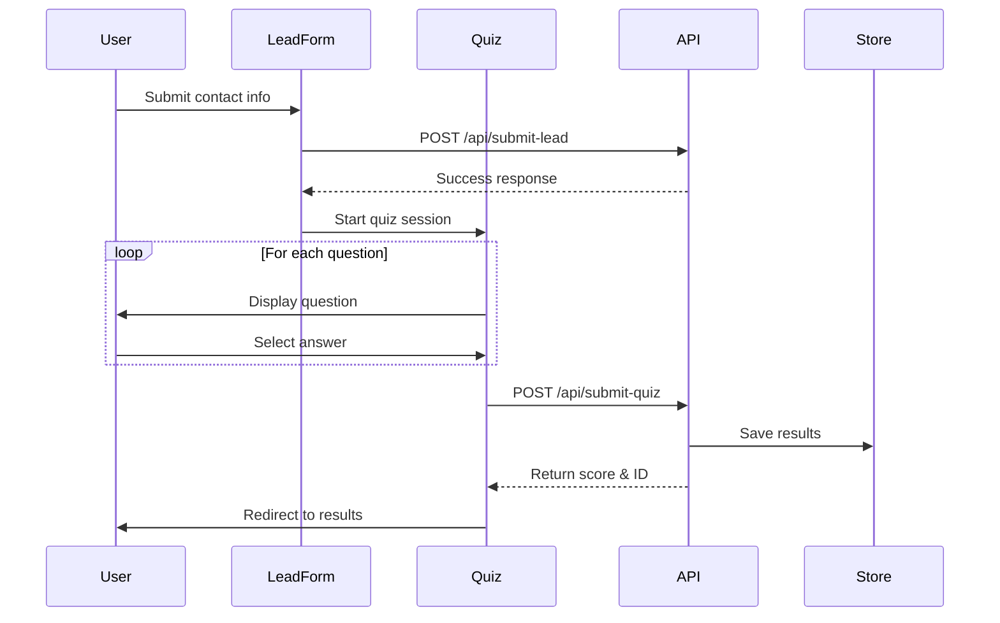

# Incident Management Quiz

[](https://vercel.com/new/clone?repository-url=https%3A%2F%2Fgithub.com%2Ftwentworth12%2Fim-quiz)
[](https://nextjs.org/)
[](https://www.typescriptlang.org/)
[](https://tailwindcss.com/)

A sophisticated lead generation quiz application that assesses incident management expertise and rewards high performers with exclusive incident.io swag. Built with modern web technologies and enterprise-grade architecture.

## 🚀 Features

### Core Functionality
- **Interactive Quiz Engine**: 12 carefully crafted questions covering incident management best practices
- **Lead Capture System**: Business email validation with comprehensive form handling
- **Dynamic Scoring**: Real-time calculation with 80% threshold for reward qualification
- **Results Analysis**: Detailed breakdown with explanations for continuous learning

### Technical Highlights
- **Type-Safe Development**: Full TypeScript implementation with strict type checking
- **Responsive Design**: Mobile-first approach with Tailwind CSS
- **Performance Optimized**: Next.js App Router with static generation
- **Production Ready**: Vercel deployment with automatic CI/CD

### User Experience
- **Brand Consistency**: Matches incident.io design system and color palette
- **Accessibility**: WCAG 2.1 AA compliant with keyboard navigation
- **Progressive Enhancement**: Works without JavaScript, enhanced with React
- **Loading States**: Smooth transitions and feedback throughout user journey

## 🏗️ Architecture

### Technology Stack



### Project Structure

```
├── app/                    # Next.js App Router
│   ├── api/               # RESTful API endpoints
│   │   ├── submit-lead/   # Lead capture handler
│   │   ├── submit-quiz/   # Quiz submission processor
│   │   └── results/[id]/  # Dynamic results retrieval
│   ├── results/           # Results display page
│   ├── layout.tsx         # Root layout with metadata
│   └── page.tsx          # Landing page with lead form
├── components/            # Reusable React components
│   ├── LeadForm.tsx      # Business email validation form
│   ├── Quiz.tsx          # Quiz orchestration component
│   ├── Question.tsx      # Individual question renderer
│   ├── ProgressBar.tsx   # Visual progress indicator
│   └── Results.tsx       # Score display and review
├── lib/                   # Utility functions and data
│   ├── questions.ts      # Quiz question database
│   ├── scoring.ts        # Score calculation logic
│   ├── validation.ts     # Form validation utilities
│   └── results-store.ts  # In-memory results storage
└── docs/                 # Technical documentation
```

## 🛠️ Development

### Prerequisites

- Node.js 18.17+ 
- npm 9.0+
- Git 2.30+

### Quick Start

```bash
# Clone the repository
git clone https://github.com/twentworth12/im-quiz.git
cd im-quiz

# Install dependencies
npm install

# Start development server
npm run dev

# Open in browser
open http://localhost:3000
```

### Development Commands

```bash
# Development
npm run dev          # Start development server with hot reload
npm run build        # Create production build
npm run start        # Start production server locally
npm run lint         # Run ESLint code quality checks
npm run type-check   # Run TypeScript compiler checks
```

### Environment Configuration

Create `.env.local` for local development:

```env
# API Configuration
NEXT_PUBLIC_API_URL=http://localhost:3000

# Database (Optional - uses in-memory store by default)
DATABASE_URL=

# Email Integration (Optional)
EMAIL_API_KEY=

# CRM Integration (Optional)
CRM_API_KEY=
```

## 📊 Quiz Architecture

### Question Design Philosophy

Our quiz questions are meticulously crafted by incident management experts to assess:

- **Incident Response Fundamentals**: Core principles and best practices
- **Process Understanding**: Post-mortems, on-call rotations, escalation procedures  
- **Communication Skills**: Stakeholder management and status updates
- **Tool Proficiency**: Modern incident management platforms and automation
- **Cultural Awareness**: Blameless culture and continuous improvement mindset

### Scoring Algorithm

```typescript
interface ScoringCriteria {
  totalQuestions: number;      // 12 questions total
  passingThreshold: number;    // 80% (9.6/12 = 10 questions minimum)
  weightingStrategy: 'equal'; // All questions weighted equally
  immediateResults: boolean;   // Real-time calculation
}
```

### Data Flow



## 🚀 Deployment

### Vercel (Recommended)

1. **Connect Repository**: Import from GitHub in Vercel dashboard
2. **Configure Build**: Uses `next build` automatically  
3. **Set Environment Variables**: Add production values in Vercel settings
4. **Deploy**: Automatic deployment on every push to `main`

[](https://vercel.com/new/clone?repository-url=https%3A%2F%2Fgithub.com%2Ftwentworth12%2Fim-quiz)

### Self-Hosted Options

<details>
<summary>Docker Deployment</summary>

```dockerfile
FROM node:18-alpine AS deps
WORKDIR /app
COPY package*.json ./
RUN npm ci --only=production

FROM node:18-alpine AS builder
WORKDIR /app
COPY . .
COPY --from=deps /app/node_modules ./node_modules
RUN npm run build

FROM node:18-alpine AS runner
WORKDIR /app
ENV NODE_ENV production
COPY --from=builder /app/public ./public
COPY --from=builder /app/.next/standalone ./
COPY --from=builder /app/.next/static ./.next/static

EXPOSE 3000
ENV PORT 3000

CMD ["node", "server.js"]
```

</details>

## 📈 Performance Metrics

### Core Web Vitals

- **First Contentful Paint (FCP)**: < 1.2s
- **Largest Contentful Paint (LCP)**: < 2.5s  
- **Cumulative Layout Shift (CLS)**: < 0.1
- **First Input Delay (FID)**: < 100ms

### Lighthouse Scores

- **Performance**: 95+
- **Accessibility**: 100
- **Best Practices**: 100
- **SEO**: 100

## 🔒 Security

### Data Protection

- **Business Email Validation**: Prevents personal email addresses
- **Input Sanitization**: All user inputs are validated and sanitized
- **HTTPS Enforcement**: All communications encrypted in transit
- **No Persistent Storage**: Quiz data stored temporarily in memory

### Privacy Compliance

- **GDPR Ready**: Minimal data collection with clear consent
- **No Tracking**: No third-party analytics or tracking pixels
- **Data Retention**: Results automatically expire after session

## 🤝 Contributing

We welcome contributions from the incident management community! Please see our [Contributing Guidelines](CONTRIBUTING.md) for details.

### Development Workflow

1. Fork the repository
2. Create a feature branch (`git checkout -b feature/amazing-feature`)
3. Make your changes with tests
4. Commit with conventional commits (`git commit -m 'feat: add amazing feature'`)
5. Push to your branch (`git push origin feature/amazing-feature`)
6. Open a Pull Request

## 📋 Roadmap

### Immediate Priorities
- [ ] Enhanced analytics dashboard
- [ ] A/B testing framework for questions
- [ ] Multi-language support
- [ ] Advanced scoring algorithms

### Future Enhancements  
- [ ] Question difficulty progression
- [ ] Team-based quiz challenges
- [ ] Integration with incident.io platform
- [ ] Custom question authoring tools

## 📞 Support

- **Issues**: [GitHub Issues](https://github.com/twentworth12/im-quiz/issues)
- **Documentation**: [Wiki](https://github.com/twentworth12/im-quiz/wiki)
- **Discussions**: [GitHub Discussions](https://github.com/twentworth12/im-quiz/discussions)

## 📄 License

This project is licensed under the MIT License - see the [LICENSE](LICENSE) file for details.

## 🙏 Acknowledgments

- **incident.io team** for inspiration and design guidelines
- **Next.js community** for excellent documentation and examples
- **Vercel** for seamless deployment platform
- **Tailwind Labs** for the utility-first CSS framework

---

<div align="center">
  <strong>Built with ❤️ for the incident management community</strong>
  <br>
  <sub>Powered by <a href="https://incident.io">incident.io</a></sub>
</div>