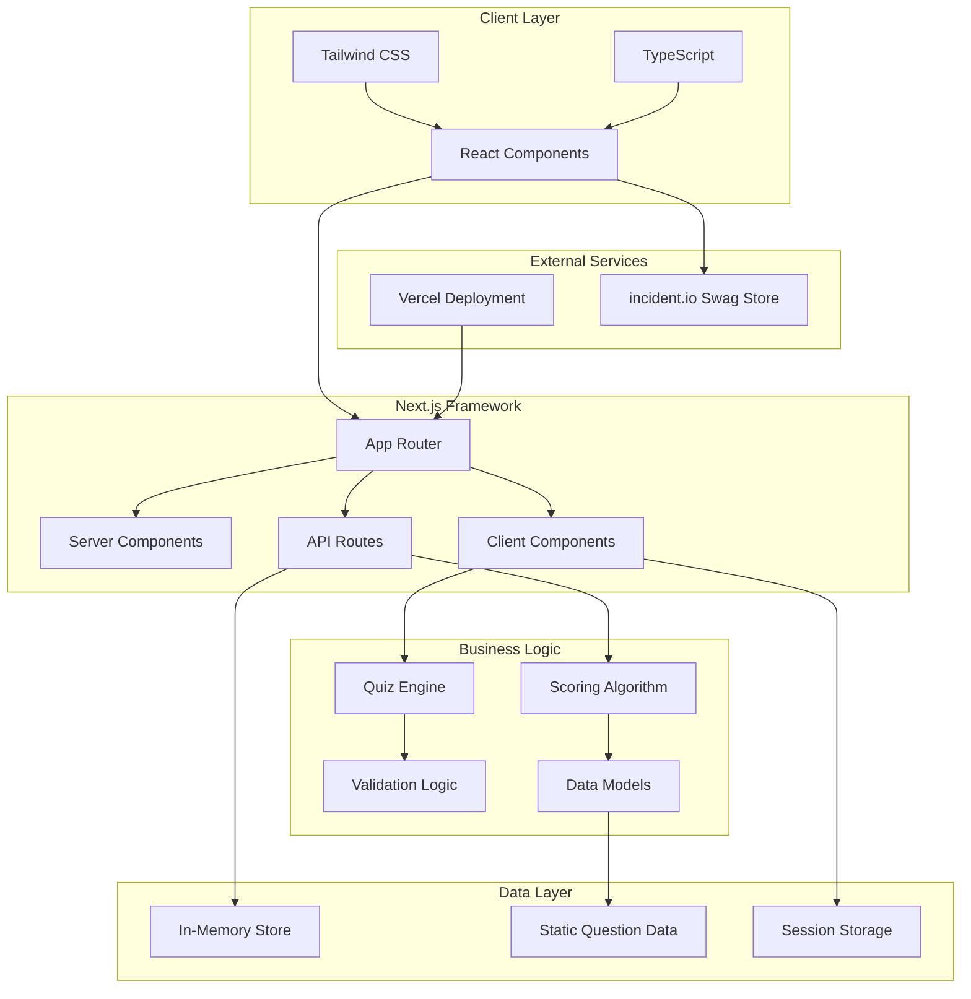
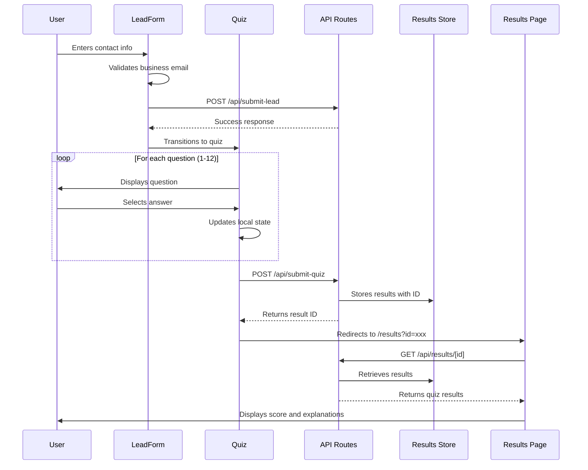
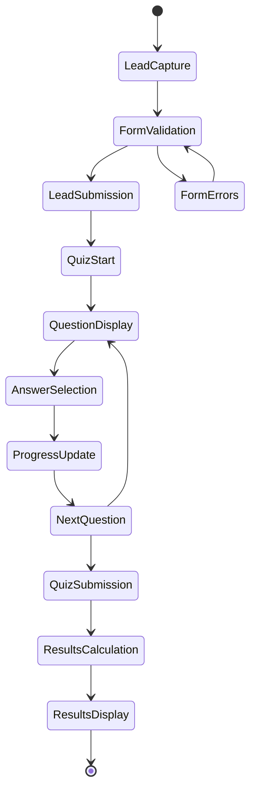
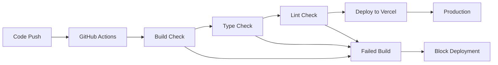

# Architecture Documentation

## 🏗️ System Overview

The Incident Management Quiz is a modern web application built with Next.js 14, designed for high performance, scalability, and maintainability. The architecture follows a component-driven approach with clear separation of concerns.

## 📊 Architecture Diagram



## 🔧 Technology Stack

### Frontend Framework
- **Next.js 14.2.3**: React-based framework with App Router
- **React 18.3.1**: Component library with hooks and concurrent features
- **TypeScript 5.4.5**: Type-safe development environment

### Styling & UI
- **Tailwind CSS 3.4.3**: Utility-first CSS framework
- **CSS Variables**: Custom properties for theming
- **Responsive Design**: Mobile-first approach

### Development Tools
- **ESLint 8.57.0**: Code quality and style enforcement
- **PostCSS**: CSS processing and autoprefixing
- **TypeScript Compiler**: Strict type checking

## 📁 Project Structure

```
im-quiz/
├── app/                    # Next.js App Router
│   ├── api/               # Backend API endpoints
│   │   ├── submit-lead/   # Lead capture processing
│   │   ├── submit-quiz/   # Quiz result processing
│   │   └── results/[id]/  # Dynamic result retrieval
│   ├── results/           # Results page with Suspense
│   ├── globals.css        # Global styles and theme
│   ├── layout.tsx         # Root layout with metadata
│   └── page.tsx          # Landing page with lead form
├── components/            # Reusable React components
│   ├── LeadForm.tsx      # Contact information capture
│   ├── Quiz.tsx          # Main quiz orchestration
│   ├── Question.tsx      # Individual question display
│   ├── ProgressBar.tsx   # Visual progress tracking
│   └── Results.tsx       # Score display and review
├── lib/                   # Business logic and utilities
│   ├── questions.ts      # Quiz question database
│   ├── scoring.ts        # Score calculation engine
│   ├── validation.ts     # Input validation utilities
│   └── results-store.ts  # Temporary result storage
├── docs/                 # Technical documentation
├── .github/              # GitHub templates and workflows
└── public/               # Static assets
```

## 🔄 Data Flow

### User Journey Flow



### State Management



## 🧩 Component Architecture

### Component Hierarchy

```
App (layout.tsx)
├── HomePage (page.tsx)
│   ├── LeadForm
│   │   ├── FormFields
│   │   ├── ValidationMessages
│   │   └── SubmitButton
│   └── Quiz (conditional)
│       ├── ProgressBar
│       ├── Question
│       │   ├── QuestionText
│       │   ├── AnswerOptions
│       │   └── NavigationButtons
│       └── LoadingState
└── ResultsPage (results/page.tsx)
    ├── Suspense Boundary
    └── Results
        ├── ScoreDisplay
        ├── SwagMessage (conditional)
        ├── QuestionReview
        │   ├── QuestionCard
        │   ├── AnswerOptions
        │   └── Explanation
        └── RetakeButton
```

### Component Responsibilities

#### LeadForm Component
- **Purpose**: Captures user contact information
- **Validation**: Business email validation, required field checking
- **State Management**: Form data, validation errors, submission status
- **Integration**: Submits to `/api/submit-lead` endpoint

#### Quiz Component
- **Purpose**: Orchestrates the quiz experience
- **State Management**: Current question index, user answers, submission state
- **Navigation**: Forward/backward movement, progress tracking
- **Integration**: Submits to `/api/submit-quiz` endpoint

#### Question Component
- **Purpose**: Displays individual quiz questions
- **Features**: Radio button selection, answer persistence, navigation
- **Accessibility**: Keyboard navigation, screen reader support
- **Styling**: incident.io brand consistency

#### Results Component
- **Purpose**: Displays quiz results and explanations
- **Features**: Score visualization, answer review, SWAG qualification
- **Education**: Detailed explanations for learning
- **Actions**: Retake option, swag store link

## 🔧 API Design

### Endpoint Specifications

#### POST /api/submit-lead
```typescript
// Request
interface LeadRequest {
  fullName: string;
  email: string;        // Business email required
  company: string;
  companySize: string;
  role: string;
  phone?: string;
  source?: string;
}

// Response
interface LeadResponse {
  success: boolean;
  message: string;
}
```

#### POST /api/submit-quiz
```typescript
// Request
interface QuizRequest {
  leadData: LeadFormData;
  answers: Record<number, number>;  // questionId -> answerIndex
  timestamp: string;
}

// Response
interface QuizResponse {
  success: boolean;
  id: string;           // Result ID for retrieval
  result: QuizResult;
}
```

#### GET /api/results/[id]
```typescript
// Response
interface ResultsResponse {
  success: boolean;
  result: QuizResult;
  timestamp: string;
}
```

### Data Models

#### Quiz Question Model
```typescript
interface Question {
  id: number;                    // Unique identifier
  question: string;              // Question text
  options: string[];             // Answer choices (4 options)
  correctAnswer: number;         // Index of correct answer (0-3)
  explanation: string;           // Educational explanation
}
```

#### Quiz Result Model
```typescript
interface QuizResult {
  score: number;                 // Number of correct answers
  percentage: number;            // Score as percentage (0-100)
  correctAnswers: number;        // Same as score (for clarity)
  totalQuestions: number;        // Total number of questions (12)
  passed: boolean;              // Whether user passed (≥80%)
  answers: UserAnswer[];        // Detailed answer breakdown
}

interface UserAnswer {
  questionId: number;           // Reference to question
  selectedAnswer: number;       // User's selected answer index
  isCorrect: boolean;          // Whether answer was correct
}
```

## 🎯 Business Logic

### Scoring Algorithm

The scoring system implements a straightforward percentage-based approach:

```typescript
function calculateScore(questions: Question[], userAnswers: Record<number, number>): QuizResult {
  let correctAnswers = 0;
  const answers: UserAnswer[] = [];
  
  // Process each question
  questions.forEach((question) => {
    const userAnswer = userAnswers[question.id];
    const isCorrect = userAnswer === question.correctAnswer;
    
    if (isCorrect) correctAnswers++;
    
    answers.push({
      questionId: question.id,
      selectedAnswer: userAnswer,
      isCorrect
    });
  });
  
  const percentage = Math.round((correctAnswers / questions.length) * 100);
  const passed = percentage >= PASSING_SCORE; // 80%
  
  return {
    score: correctAnswers,
    percentage,
    correctAnswers,
    totalQuestions: questions.length,
    passed,
    answers
  };
}
```

### Validation Logic

#### Email Validation
```typescript
function validateEmail(email: string): boolean {
  // Basic email format check
  const emailRegex = /^[^\s@]+@[^\s@]+\.[^\s@]+$/;
  if (!emailRegex.test(email)) return false;
  
  // Business email domain check
  const domain = email.split('@')[1].toLowerCase();
  const personalDomains = ['gmail.com', 'yahoo.com', 'hotmail.com', ...];
  
  return !personalDomains.includes(domain);
}
```

#### Form Validation
```typescript
function validateLeadForm(data: LeadFormData): ValidationResult {
  const errors: Record<string, string> = {};
  
  if (!data.fullName?.trim()) errors.fullName = "Full name is required";
  if (!validateEmail(data.email)) errors.email = "Business email required";
  if (!data.company?.trim()) errors.company = "Company name is required";
  if (!data.companySize) errors.companySize = "Company size is required";
  if (!data.role?.trim()) errors.role = "Role is required";
  
  return {
    isValid: Object.keys(errors).length === 0,
    errors
  };
}
```

## 🚀 Performance Considerations

### Optimization Strategies

#### Static Generation
- **Questions**: Pre-built at compile time
- **Styles**: CSS extracted and optimized
- **Components**: Server-side rendering where possible

#### Client-Side Optimization
- **Code Splitting**: Automatic route-based splitting
- **Tree Shaking**: Unused code elimination
- **Minification**: JavaScript and CSS compression

#### Bundle Analysis
```bash
# Analyze bundle size
npm run build
npm run analyze  # Custom script for bundle analysis
```

### Performance Metrics

#### Target Metrics
- **First Contentful Paint**: < 1.2s
- **Largest Contentful Paint**: < 2.5s
- **Time to Interactive**: < 3.0s
- **Cumulative Layout Shift**: < 0.1

#### Monitoring
- Vercel Analytics integration
- Core Web Vitals tracking
- Real User Monitoring (RUM)

## 🔒 Security Architecture

### Data Protection

#### Input Sanitization
- All user inputs validated server-side
- XSS prevention through React's built-in escaping
- SQL injection not applicable (no database)

#### Privacy by Design
- Minimal data collection
- No persistent storage of personal data
- Session-based result storage only

#### Transport Security
- HTTPS enforcement via Vercel
- Secure headers configuration
- Content Security Policy implementation

### Security Headers

```typescript
// next.config.js security headers
const securityHeaders = [
  {
    key: 'X-DNS-Prefetch-Control',
    value: 'on'
  },
  {
    key: 'Strict-Transport-Security',
    value: 'max-age=63072000; includeSubDomains; preload'
  },
  {
    key: 'X-Frame-Options',
    value: 'DENY'
  },
  {
    key: 'X-Content-Type-Options',
    value: 'nosniff'
  }
];
```

## 📊 Monitoring & Analytics

### Application Monitoring

#### Error Tracking
- Client-side error boundary implementation
- Server-side error logging
- Performance monitoring via Vercel

#### User Analytics
- Quiz completion rates
- Drop-off analysis
- Time-to-completion metrics
- Success rate tracking

### Business Metrics

#### Lead Quality
- Business email compliance rate
- Company size distribution
- Role/title analysis
- Geographic distribution

#### Quiz Performance
- Average scores by question
- Question difficulty analysis
- Common wrong answers
- Learning effectiveness

## 🔄 Deployment Architecture

### CI/CD Pipeline



### Environment Management

#### Development
- Local development server
- Hot module replacement
- Development-only logging

#### Production
- Vercel serverless deployment
- CDN optimization
- Automatic HTTPS
- Edge functions for global performance

### Scaling Considerations

#### Horizontal Scaling
- Serverless functions auto-scale
- CDN handles static assets
- No database bottlenecks

#### Performance Scaling
- Image optimization via Vercel
- Automatic code splitting
- Efficient caching strategies

## 🛠️ Development Workflow

### Local Development

```bash
# Environment setup
npm install
npm run dev

# Development commands
npm run build      # Production build test
npm run lint       # Code quality check
npm run type-check # TypeScript validation
```

### Code Quality

#### Automated Checks
- ESLint for code style
- TypeScript for type safety
- Prettier for formatting (optional)
- Pre-commit hooks (if configured)

#### Review Process
- Pull request required
- Automated build verification
- Manual code review
- Preview deployment testing

This architecture provides a solid foundation for a scalable, maintainable, and performant quiz application while maintaining simplicity and developer experience.